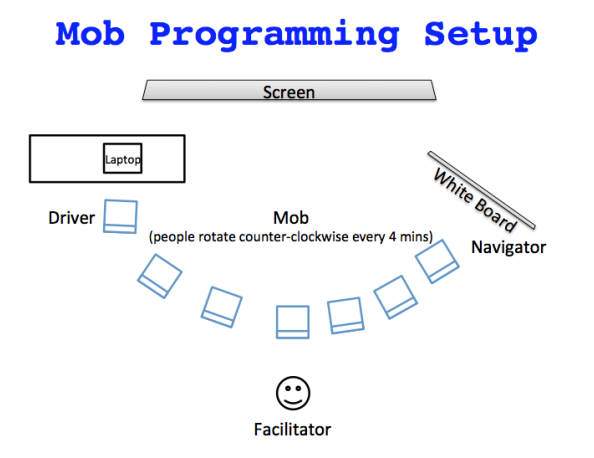

<!-- .slide: data-background="images/road-3478977_1920.jpg" -->

<h2 style="position: absolute; top: 390px; right: -150px; color: #ccc; text-transform: none;">Funktionale Programmierung</h2>

<p style="position: absolute; top: 470px; right: -145px; color: #ccc; text-transform: none; text-align: right" class="my-shadow">@mobilgroma</p>
<p style="position: absolute; top: 520px; right: -145px; color: #ccc; text-transform: none; text-align: right" class="my-shadow">@drechsler<br/>Redheads Ltd.</p>

Note:
Diese Notizen erscheinen nur als Speaker Notes (optional)

---


<div style="position: absolute; top: 100px; left: 200px; height: 1000px; width: 800px;">
  <h4>Patrick Drechsler</h4>
  <ul class="small-font" >
    <li>Software Entwickler / Architekt</li>
    <li>Beruflich: C# (und TS/JS)</li>
    <li>Interessen:</li>
    <ul>
      <li>Software Crafting</li>
      <li>Domain-Driven-Design</li>
      <li>Funktionale Programmierung</li>
    </ul>
    
    <li>...</li>
  </ul>
</div>

<div style="position: absolute; top: 500px; left: 600px">
  
</div>

<div style="position: absolute; top: 520px; left: -100px" class="small-font">
  <i class="fa fa-twitter" aria-hidden="true"></i> @drechsler
  <i class="fa fa-github" aria-hidden="true"></i> draptik
  <!--  -->
</div>

---


<div style="position: absolute; top: 100px; left: 200px; height: 1000px; width: 800px;">
  <h4>Martin Grotz</h4>
  <ul class="small-font" >
    <li>Software Entwickler</li>
    <li>Interessen:</li>
    <ul>
      <li>Software Crafting</li>
      <li>Domain-Driven-Design</li>
      <li>Funktionale Programmierung</li>
    </ul>
    
    <li>...</li>
  </ul>
</div>

<div style="position: absolute; top: 500px; left: 400px">
  
</div>

---

## Vorstellungsrunde
## &
## Erwartungen

---

## Mob Programming

- wir lernen gemeinsam
- Pair Programming in der Gruppe


----



----

- Driver: Sitzt an der Tastatur (darf nicht denken)
- Navigator: Sagt dem Driver, was zu tun ist
- Mob: Unterstuetzt den Navigator
- Regelmaessiger Wechsel (3-5min)

----

### "Assisted" Mob Programming

- Facilitator unterstuetzt den Navigator

---

## FP 101

- Immutability
- Functions as First Class Citizens
- Pure Functions (see Immutability)

That's it!

---

#### Immutability in C# #


```csharp
public class Customer
{
  public string Name { get; set; }
}
```

vs

```csharp
public class Customer
{
  public Customer(string name)
  {
    Name = name;
  }
  
  public string Name { get; }
}
```

---

#### 1st class functions in C# #


```csharp
public class Customer
{
  public string DoMagic(bool isSomething, Func<string, string> func)
  {
    if (isSomething)
      return func();
    
    return "failure";
  }
}
```

---

#### Pure Functions in C# #

- haben niemals Seiteneffekte!
- sollten immer nach `static` umwandelbar sein

---

Schränken uns diese FP Paradigmen ein?

---

Wie kann man mit diesem "Purismus" Software schreiben, die etwas tut?


