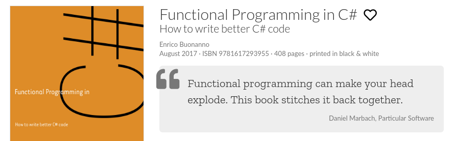
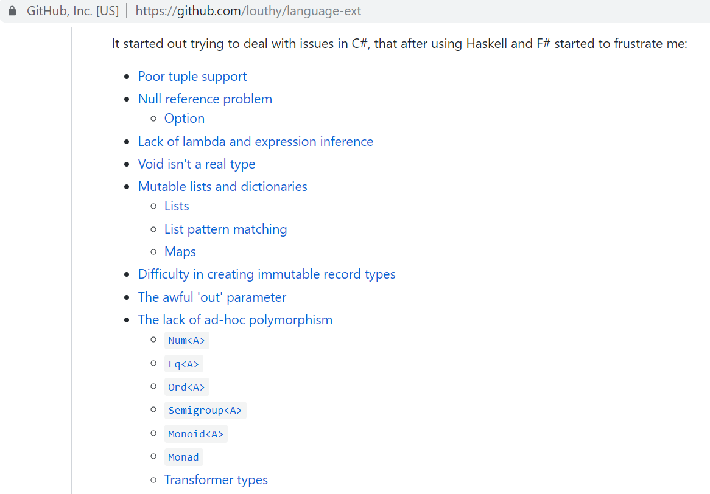
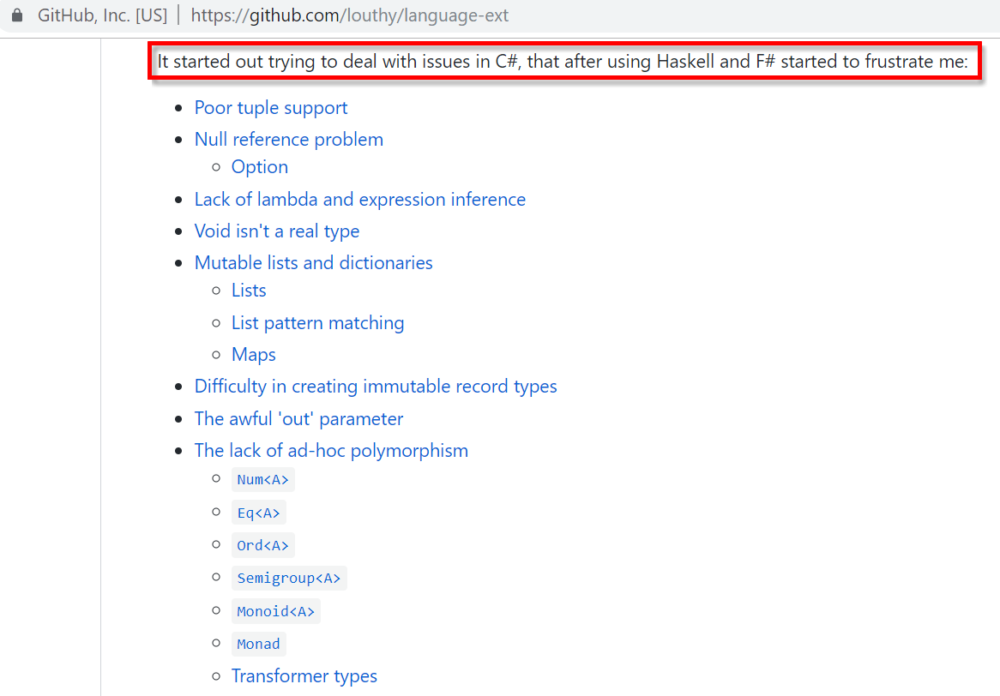
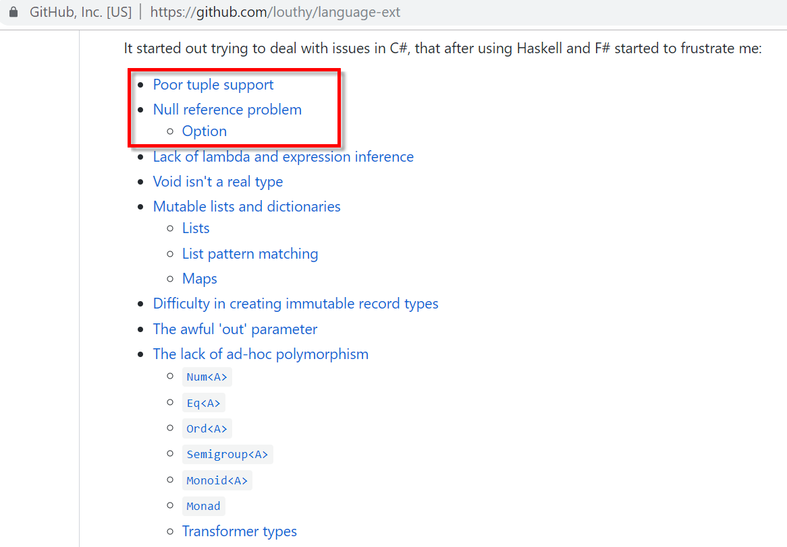
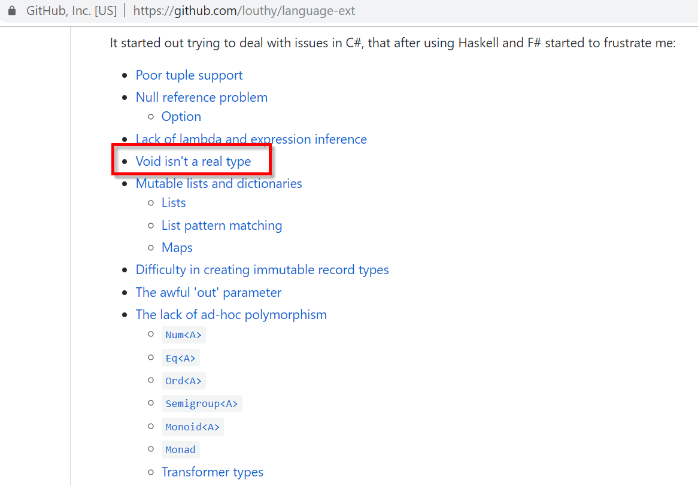
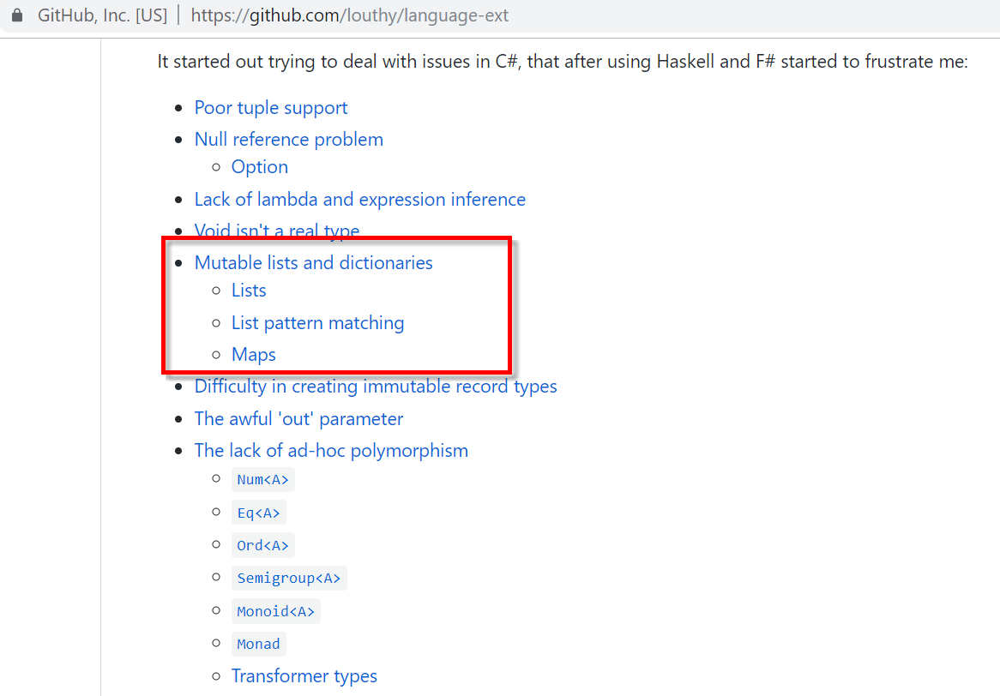
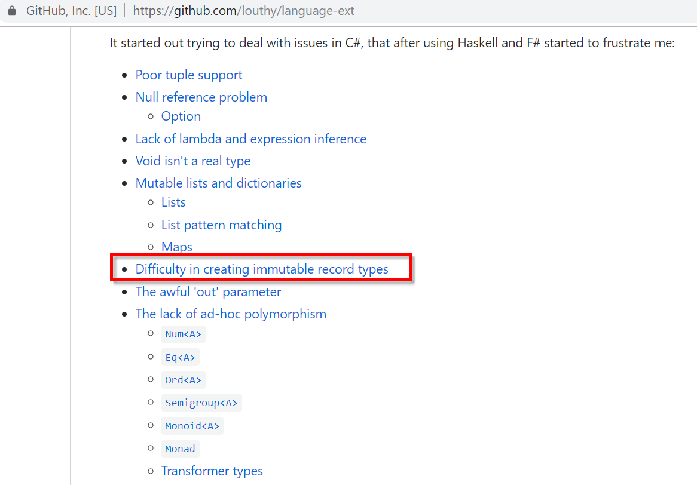
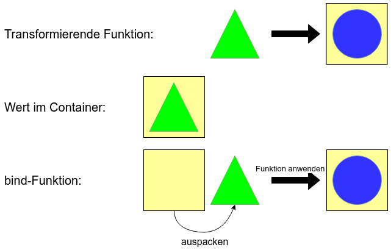

<!-- .slide: data-background="images/road-3478977_1920.jpg" -->

<h2 style="position: absolute; top: 390px; right: -150px; color: #ccc; text-transform: none;">Funktionale Programmierung</h2>

<p style="position: absolute; top: 470px; right: -145px; color: #ccc; text-transform: none; text-align: right" class="my-shadow">@mobilgroma</p>
<p style="position: absolute; top: 520px; right: -145px; color: #ccc; text-transform: none; text-align: right" class="my-shadow">@drechsler<br/>Redheads Ltd.</p>

Note:
Diese Notizen erscheinen nur als Speaker Notes (optional)

---


<div style="position: absolute; top: 100px; left: 200px; height: 1000px; width: 800px;">
  <h4>Patrick Drechsler</h4>
  <ul class="small-font" >
    <li>Software Entwickler / Architekt</li>
    <li>Beruflich: C# (und TS/JS)</li>
    <li>Interessen:</li>
    <ul>
      <li>Software Crafting</li>
      <li>Domain-Driven-Design</li>
      <li>Funktionale Programmierung</li>
    </ul>
    
    <li>...</li>
  </ul>
</div>

<div style="position: absolute; top: 500px; left: 600px">
  
</div>

<div style="position: absolute; top: 520px; left: -100px" class="small-font">
  <i class="fa fa-twitter" aria-hidden="true"></i> @drechsler
  <i class="fa fa-github" aria-hidden="true"></i> draptik
  <!--  -->
</div>

---


<div style="position: absolute; top: 100px; left: 200px; height: 1000px; width: 800px;">
  <h4>Martin Grotz</h4>
  <ul class="small-font" >
    <li>Software Entwickler</li>
    <li>Interessen:</li>
    <ul>
      <li>Software Crafting</li>
      <li>Domain-Driven-Design</li>
      <li>Funktionale Programmierung</li>
    </ul>
    
    <li>...</li>
  </ul>
</div>

<div style="position: absolute; top: 500px; left: 400px">
  
</div>

---

## Vorstellungsrunde
## &
## Erwartungen

---

## Mob Programming

- wir lernen gemeinsam
- Pair Programming in der Gruppe


----


----

- Driver: Sitzt an der Tastatur (darf nicht denken)
- Navigator: Sagt dem Driver, was zu tun ist
- Mob: Unterstuetzt den Navigator
- Regelmaessiger Wechsel (3-5min)

----

### "Assisted" Mob Programming

- Facilitator unterstuetzt den Navigator

---

## FP 101

- Immutability
- Functions as First Class Citizens
- Pure Functions (see Immutability)

That's it!

---

#### Immutability in C# #


```csharp
public class Customer
{
  public string Name { get; set; } // set -> mutable :-(
}
```

vs

```csharp
public class Customer
{
  public Customer(string name)
  {
    Name = name;
  }
  
  public string Name { get; } // <- immutable
}
```

---

#### 1st class functions in C# #


```csharp
// Func as parameter
public string Greet(Func<string, string> greeterFunction, string name)
{
  return greeterFunction(name);
}
```

```csharp
Func<string, string> formatGreeting = (name) => $"Hello, {name}";
var greetingMessage = Greet(formatGreeting, "dodnedder");
// -> greetingMessage: "Hello, dodnedder"
```

---

#### Pure Functions in C# #

- haben niemals Seiteneffekte!
- sollten immer nach `static` umwandelbar sein

----

```csharp
// method signature lies!
int Add(int a, int b)
{
  Console.WriteLine("foo"); // <- side effect!
  return a + b;
}
```

----

```csharp
int Add(int a, int b)
{
  Console.WriteLine("foo");
  return a + b;
}
```

```csharp
int Add(int a, int b)
{
  return a + b;
}
```

Expression body syntax:
```csharp
int Add(int a, int b) => a + b;
```

---

Und was hat es mit

Filter

Map

Reduce

auf sich?

---

Schränken uns diese FP Paradigmen ein?

---

Wie kann man mit diesem "Purismus" Software schreiben, die etwas tut?

---

# Let's code

(almost)

---

One more thing: Die Fachlichkeit

(laesstiges Detail...)

---

### Kontakt-App

---

### Kontakt-App

Einträge 
- Hinzufügen
- Auflisten
- Löschen 

----

- Eintrag
  - Vorname
  - Nachname
  - (Kontaktmethode)
  - optionale Felder
    - Geburtstag
    - Twitter-Link

----

## Persistenz
- Eintrag wird serialisiert und in Datei abgelegt
- Eine Datei für alle Einträge
- In der Praxis problematisch: Gleichzeitiger Zugriff auf die gleiche Datei
---

Und warum hat C# andere Verben verwendet?

- Als C# LINQ eingefuehrt hat, war FP nicht hipp
- SQL ist funktional

-> Syntax

---

## LINQ - fuer Listen (IEnumerable in C#)

Allg.: Funktionen, die auf eine Liste angewendet werden

Bsp:

- Option ist eigentlich nur eine Liste mit 2 Werten (Some und None)
- Result -> Liste mit 2 Werten (Left und Right)
- etc.

---

In FP unterscheidet man die Wrapper-Klassen (zB IEnumerable) anhand der Funktionen, die sie bereitstellen

---

### LaYumba

----

### LaYumba

 <!-- .element: class="borderless" -->

----

### LaYumba

"einfache" Variante von [language-ext](https://github.com/louthy/language-ext)

----

 <!-- .element: class="borderless" -->

----

 <!-- .element: class="borderless" -->

----

 <!-- .element: class="borderless" -->

----

 <!-- .element: class="borderless" -->

----

 <!-- .element: class="borderless" -->

----

 <!-- .element: class="borderless" -->

----

### LaYumba

- NuGet Paket
- kann nicht alles
- Fokus: Didaktik (Aehnlichkeit mit F#, Haskell)

---

## FP-Konzepte

- Gängige Vorgehensweise: Kleine Funktionen werden zu immer größeren Funktionalitäten zusammengesteckt
- Problem: Nicht alle Funktionen passen gut zusammen

---

## Wert in Container, Funktion passt nicht
```fsharp
let toUpper (s : string) = s.ToUpper()

let stringToOption s =
    if String.IsNullOrWhiteSpace s then
        None
    else
        Some s

let nonEmptyStringToUpper s =
    let nonEmpty = stringToOption s
    // passt nicht: "string" erwartet, aber "string option" bekommen
    let nonEmptyUpper = toUpper nonEmpty
```

---

## Mappable


---

## Mappable
- Container mit "map" Funktion (die bestimmten Regeln folgt): Mappable
- Bezeichnung in der FP-Welt: **Funktor**
- 
```fsharp
  map: (a -> b) -> F a -> F b
```
- Andere Bezeichnungen für "map": fmap (z.B. in Haskell), Select (LINQ), <$>, <!>

---

## Wert in Container, Funktion passt nicht
```fsharp
let toUpper (s : string) = s.ToUpper()

let stringToOption s =
    if String.IsNullOrWhiteSpace s then
        None
    else
        Some s

let nonEmptyStringToUpper s =
    let nonEmpty = stringToOption s
    let nonEmptyUpper = Option.map toUpper nonEmpty
```

---

## Verkettung
```fsharp
let storeInDatabase path content = 
  try
    System.IO.File.WriteAllText(path, content)
    Some content
  with
  | :? Exception as ex -> None

let stringToOption s =
    if String.IsNullOrWhiteSpace s then
        None
    else
        Some s

let toUpper (s : string) = s.ToUpper()

let nonEmptyStringStoreInPersistenceAndToUpper path content =
    let nonEmpty = stringToOption content
    // passt nicht: "string" erwartet, aber "string option" bekommen
    let stored = storeInDatabase path nonEmpty
    // passt nicht: "string option" erwartet, aber "string option option" bekommen
    let nonEmptyUpper = Option.map toUpper stored
```

---

## Chainable



---

## Chainable
- Container mit "bind" Funktion (die bestimmten Regeln folgt): Chainable
- Bezeichnung in der FP-Welt: **Monade**
- ```fsharp
  bind: (a -> M b) -> M a -> M b
```
- Andere Bezeichnungen für "bind": flatMap, SelectMany (LINQ), >>=

---

## Verkettung
```fsharp
let storeInDatabase path content = 
  try
    System.IO.File.WriteAllText(path, content)
    Some content
  with
  | :? Exception as ex -> None

let stringToOption s =
    if String.IsNullOrWhiteSpace s then
        None
    else
        Some s

let toUpper (s : string) = s.ToUpper()

let nonEmptyStringStoreInPersistenceAndToUpper path content =
    let nonEmpty = stringToOption content
    let stored = Option.bind (storeInDatabase path) nonEmpty
    let nonEmptyUpper = Option.map toUpper stored
```

---

## Funktion mit mehreren Parametern
```fsharp
let add a b = a + b

let onlyPositive i =
  if i > 0 then
    Some i
  else
    None

let addTwoNumbers a b =
  let positiveA = onlyPositive a
  let positiveB = onlyPositive b
  // passt nicht, 2x int erwartet, aber 2x int option übergeben
  let sum = add positiveA positiveB

  // für zwei in F# bereits vordefiniert:
  let sum = Option.map2 add positiveA positiveB

  // aber was, wenn man mehr Parameter hat?

```

---

## Applicative


---

## Applicative
- Container mit "apply" Funktion (die bestimmten Regeln folgt): Applicative
- Bezeichnung in der FP-Welt: **Applicative Functor**
- 
```fsharp
  apply: AF (a -> b) -> AF a -> AF b
```
- Andere Bezeichnungen für "apply": ap, <*>

---

## Funktion mit mehreren Parametern

```fsharp
let sum a b c = a + b + c

let onlyPositive i =
    if i > 0 then Some i
    else None

let addNumbers a b c =
    let positiveA = onlyPositive a
    let positiveB = onlyPositive b
    let positiveC = onlyPositive c

    // sum ist vom Typ: (int -> int -> int -> int)
    // jede Zeile füllt ein Argument mehr aus
    // (Partial Application dank Currying)
    let (sum' : (int -> int -> int) option) = Option.map sum positiveA
    let (sum'' : (int -> int) option) = Option.apply sum' positiveB
    let (sum''' : (int) option) = Option.apply sum'' positiveC
```

---