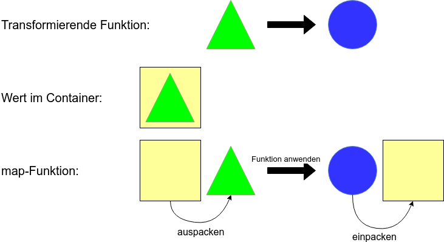

## LINQ - fuer Listen (IEnumerable in C#)

Allg.: Funktionen, die auf eine Liste angewendet werden

Bsp:

- Option ist eigentlich nur eine Liste mit 2 Werten (Some und None)
- Result -> Liste mit 2 Werten (Left und Right)
- etc.

---

In FP unterscheidet man die Wrapper-Klassen (zB IEnumerable) anhand der Funktionen, die sie bereitstellen

---

---

## FP-Konzepte

- Gängige Vorgehensweise: Kleine Funktionen werden zu immer größeren Funktionalitäten zusammengesteckt
- Problem: Nicht alle Funktionen passen gut zusammen

---

## Wert in Container, Funktion passt nicht

----

F#

```fsharp
module X

let toUpper (s : string) = s.ToUpper()

let stringToOption s =
    if String.IsNullOrWhiteSpace s then
        None
    else
        Some s

let nonEmptyStringToUpper s =
    let nonEmpty = stringToOption s
    // passt nicht: "string" erwartet, aber "string option" bekommen
    let nonEmptyUpper = toUpper nonEmpty
```

----

C#

```csharp
using LaYumba.Functional;
using static LaYumba.Functional.F;

static class X
{
  string ToUpper(string s) => s.ToUpper();

  Option<string> StringToOption(string s)
    => string.IsNullOrEmpty(s) ? None : Some(s)

  NonEmptyStringToUpper(string s)
  {
    var nonEmpty = StringToOption(s);
    // passt nicht: "string" erwartet, aber "string option" bekommen
    return ToUpper(s);
  }
}
```

---

## Mappable


---

## Mappable
- Container mit "map" Funktion (die bestimmten Regeln folgt): Mappable
- Bezeichnung in der FP-Welt: **Funktor**
- 
```fsharp
  map: (a -> b) -> F a -> F b
```
- Andere Bezeichnungen für "map": fmap (z.B. in Haskell), Select (LINQ), <$>, <!>

---

## Wert in Container, Funktion passt nicht
```fsharp
let toUpper (s : string) = s.ToUpper()

let stringToOption s =
    if String.IsNullOrWhiteSpace s then
        None
    else
        Some s

let nonEmptyStringToUpper s =
    let nonEmpty = stringToOption s
    let nonEmptyUpper = Option.map toUpper nonEmpty
```

---

## Verkettung
```fsharp
let storeInDatabase path content = 
  try
    System.IO.File.WriteAllText(path, content)
    Some content
  with
  | :? Exception as ex -> None

let stringToOption s =
    if String.IsNullOrWhiteSpace s then
        None
    else
        Some s

let toUpper (s : string) = s.ToUpper()

let nonEmptyStringStoreInPersistenceAndToUpper path content =
    let nonEmpty = stringToOption content
    // passt nicht: "string" erwartet, aber "string option" bekommen
    let stored = storeInDatabase path nonEmpty
    // passt nicht: "string option" erwartet, aber "string option option" bekommen
    let nonEmptyUpper = Option.map toUpper stored
```

---

## Chainable


---

## Chainable
- Container mit "bind" Funktion (die bestimmten Regeln folgt): Chainable
- Bezeichnung in der FP-Welt: **Monade**
- ```fsharp
  bind: (a -> M b) -> M a -> M b
```
- Andere Bezeichnungen für "bind": flatMap, SelectMany (LINQ), >>=

---

## Verkettung
```fsharp
let storeInDatabase path content = 
  try
    System.IO.File.WriteAllText(path, content)
    Some content
  with
  | :? Exception as ex -> None

let stringToOption s =
    if String.IsNullOrWhiteSpace s then
        None
    else
        Some s

let toUpper (s : string) = s.ToUpper()

let nonEmptyStringStoreInPersistenceAndToUpper path content =
    let nonEmpty = stringToOption content
    let stored = Option.bind (storeInDatabase path) nonEmpty
    let nonEmptyUpper = Option.map toUpper stored
```

---

## Funktion mit mehreren Parametern
```fsharp
let add a b = a + b

let onlyPositive i =
  if i > 0 then
    Some i
  else
    None

let addTwoNumbers a b =
  let positiveA = onlyPositive a
  let positiveB = onlyPositive b
  // passt nicht, 2x int erwartet, aber 2x int option übergeben
  let sum = add positiveA positiveB

  // für zwei in F# bereits vordefiniert:
  let sum = Option.map2 add positiveA positiveB

  // aber was, wenn man mehr Parameter hat?

```

---

## Applicative


---

## Applicative
- Container mit "apply" Funktion (die bestimmten Regeln folgt): Applicative
- Bezeichnung in der FP-Welt: **Applicative Functor**
- 
```fsharp
  apply: AF (a -> b) -> AF a -> AF b
```
- Andere Bezeichnungen für "apply": ap, <*>

---

## Funktion mit mehreren Parametern

```fsharp
let sum a b c = a + b + c

let onlyPositive i =
    if i > 0 then Some i
    else None

let addNumbers a b c =
    let positiveA = onlyPositive a
    let positiveB = onlyPositive b
    let positiveC = onlyPositive c

    // sum ist vom Typ: (int -> int -> int -> int)
    // jede Zeile füllt ein Argument mehr aus
    // (Partial Application dank Currying)
    let (sum' : (int -> int -> int) option) = Option.map sum positiveA
    let (sum'' : (int -> int) option) = Option.apply sum' positiveB
    let (sum''' : (int) option) = Option.apply sum'' positiveC
```

---