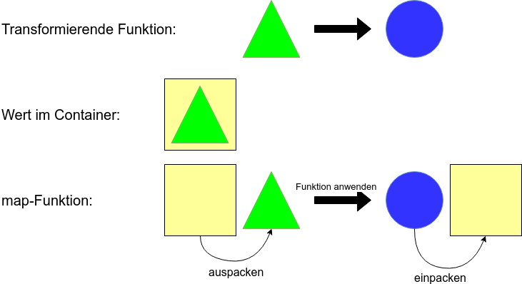

F#

```fsharp
module X

let toUpper (s : string) = s.ToUpper()

let stringToOption s =
    if String.IsNullOrWhiteSpace s then
        None
    else
        Some s

let nonEmptyStringToUpper s =
    let nonEmpty = stringToOption s
    // passt nicht: "string" erwartet, aber "string option" bekommen
    let nonEmptyUpper = toUpper nonEmpty
```

----

## Wert in Container, Funktion passt nicht

----

C#

```csharp
using LaYumba.Functional;
using static LaYumba.Functional.F;

static class X
{
  string ToUpper(string s) => s.ToUpper();

  Option<string> StringToOption(string s)
    => string.IsNullOrEmpty(s) ? None : Some(s)

  NonEmptyStringToUpper(string s)
  {
    var nonEmpty = StringToOption(s);
    // passt nicht: "string" erwartet, aber "string option" bekommen
    return ToUpper(s);
  }
}
```

----

## Mappable


---

## Mappable
- Container mit "map" Funktion (die bestimmten Regeln folgt): Mappable
- Bezeichnung in der FP-Welt: **Funktor**
- 
```fsharp
  map: (a -> b) -> F a -> F b
```
- Andere Bezeichnungen für "map": fmap (z.B. in Haskell), Select (LINQ), <$>, <!>

----

## Wert in Container, Funktion passt nicht
```fsharp
let toUpper (s : string) = s.ToUpper()

let stringToOption s =
    if String.IsNullOrWhiteSpace s then
        None
    else
        Some s

let nonEmptyStringToUpper s =
    let nonEmpty = stringToOption s
    let nonEmptyUpper = Option.map toUpper nonEmpty
```
